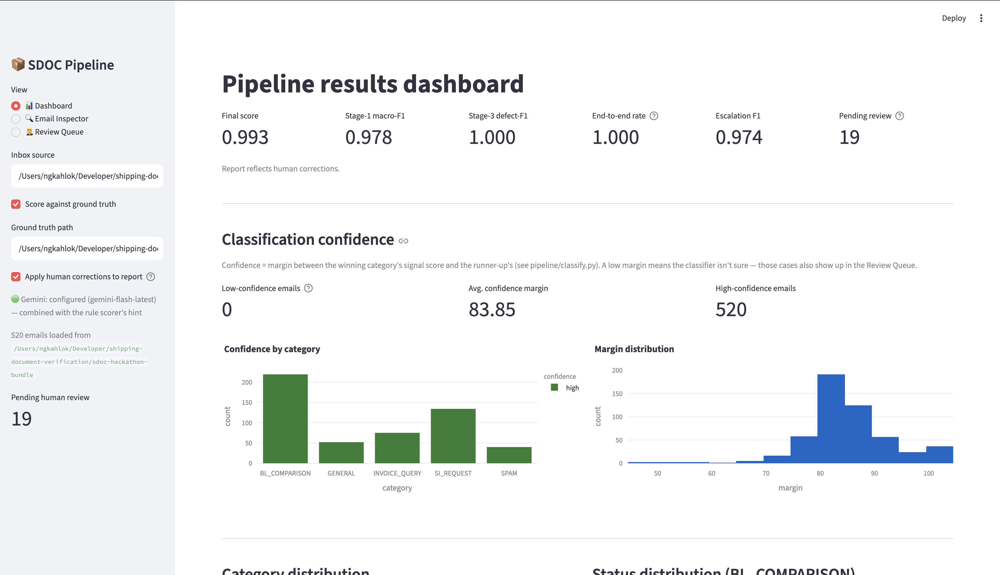
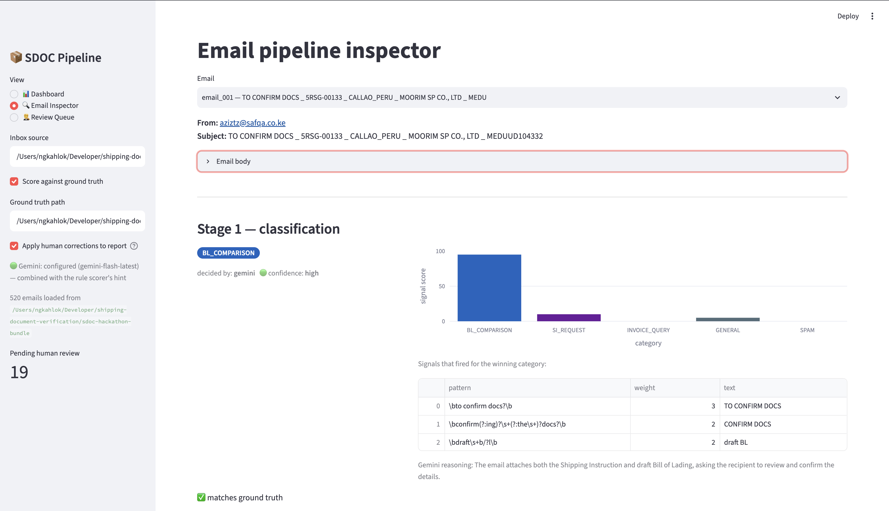
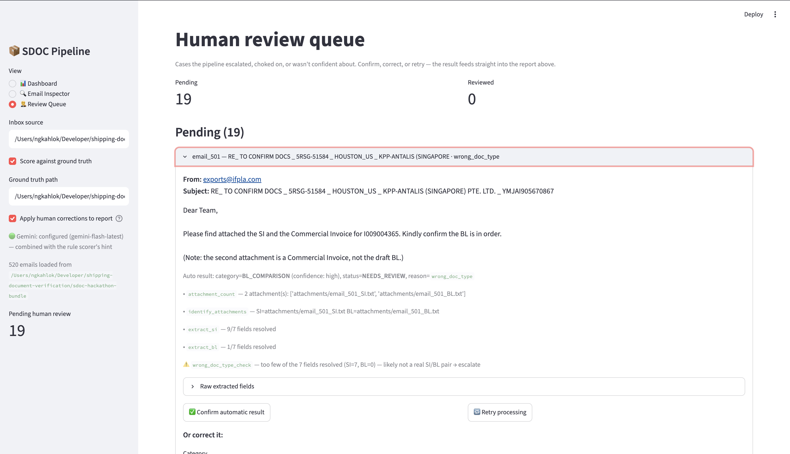

# Shipping Document Verification (SDOC)

A pipeline that reads a shipping-logistics inbox, classifies each email, and
for comparison requests, cross-checks the **Shipping Instruction (SI)**
against the **draft Bill of Lading (BL)** attachments to catch discrepancies
before documents go out. Built for the SDOC hackathon dataset in
`sdoc-hackathon-bundle/` (participant data) and `sdoc-hackathon-docker/`
(organizer data + scoring server).

Scores against the full 520-email set (see [Scoring](#scoring)):

| | Final score | Stage-1 macro-F1 | End-to-end |
|---|---|---|---|
| Rules + Gemini (combined) | **0.9935** | 0.978 | 1.000 |


## Contents

```
pipeline/
  classify.py            Stage 1: rule-based scorer + dispatch into Gemini (see below)
  gemini_classify.py      Gemini client, prompt/schema, disk cache, retry queue
  extract.py              Stage 2: per-format attachment -> (label, value) pairs
  fields.py / normalize.py   label-synonym vocabulary + cross-format value normalization
  compare.py              Stages 2b/3: reliability gate + SI-vs-BL field diff
  review_store.py         JSON-backed human-review overrides
  run.py                  CLI: builds a submission.json from a bundle
  tools/smoke_test_gemini.py     cheap ~15-call sanity check before a full Gemini run
  tools/reconcile_pending.py     retries queued emails, updates a submission.json in place
app.py                    Streamlit dashboard + inspector + human review queue
tests/test_app.py          headless Streamlit checks (streamlit.testing.v1.AppTest)
sdoc-hackathon-bundle/     participant data: inbox/, attachments/, loader.py (no labels)
sdoc-hackathon-docker/     organizer data: ground_truth.json, scoring.py, score_cli.py, Docker server
.venv/                     project-local virtualenv
```

## The task

For every email, decide:

1. **category** — `BL_COMPARISON`, `SI_REQUEST`, `INVOICE_QUERY`, `GENERAL`, or `SPAM`.
2. For `BL_COMPARISON` emails, compare the SI against the draft BL across 7
   fields — `shipper`, `consignee`, `notify_party`, `port_of_loading`,
   `port_of_discharge`, `container_count`, `gross_weight_kg` — and report:
   - `status`: `OK` (all match), `MISMATCH` (≥1 field differs), or
     `NEEDS_REVIEW` (can't decide — unreadable / missing / wrong document).
   - `has_defect` + `defect_fields` when `MISMATCH`.
   - `review_reason` when `NEEDS_REVIEW`
     (`wrong_doc_type` | `missing_attachment` | `unreadable` | `missing_value`).

The SI and BL label the same field differently (`Port of Loading` vs `Load
Port`), and attachments come in four formats (`.txt`, `.pdf`, `.docx`,
`.xlsx`) — so the extractor has to align by meaning, not by header text.

## Pipeline design

Four stages, in `pipeline/`:

- **`classify.py`** — Stage 1 (see
  [How classification works](#how-classification-works-rules--gemini-combined)).
  Its local path is a weighted keyword-signal scorer: not a literal
  template matcher, but a set of *concept* phrases per category (what a
  request like this actually says), so it has a chance of transferring to
  phrasing it's never seen —
  with a `confidence` (`high`/`low`, from the margin between the top two
  categories' scores) exposed alongside the winning label, so a genuinely
  ambiguous email can be routed to a human instead of forcing a guess.
- **`extract.py`** — Stage 2. Turns each attachment into `(label, value)`
  pairs regardless of format:
  - `.txt` — line-based, colon-split.
  - `.docx` — table rows (`python-docx`).
  - `.xlsx` — two-column cell rows (`openpyxl`).
  - `.pdf` — the hard one. Long labels (e.g. `"Notify
    Party/Intermediate Consignee"`) can visually overlap their fixed-position
    value column in the generated PDF. `pdfplumber`'s spatial word-clustering
    garbles that overlap into interleaved nonsense, so extraction works at
    the **character-stream level** instead: the underlying character order
    is always clean (every label character is emitted before the value's),
    so a label/value split is found by walking that stream and either
    following an explicit colon, or detecting where x-position runs
    backwards (a new text object starting left of where the previous one
    had already reached).
- **`fields.py`** / **`normalize.py`** — the label-synonym vocabulary and
  cross-format value normalization (strips port LOCODE suffixes, entity
  address lines, weight formatting, container count/size), so the same
  field compares equal regardless of which format or synonym rendered it.
- **`compare.py`** — Stages 2b/3. Before diffing, a reliability gate checks
  (in order): attachment count + intent (`missing_attachment`), extraction
  failure (`unreadable`), how many of the 7 fields resolved at all
  (`wrong_doc_type`), and blank/placeholder values (`missing_value`). Only
  if none of those fire does it do the field-by-field diff and report
  `OK`/`MISMATCH`.
- **`run.py`** — orchestrates the above into a `submission.json`.

Every module also exposes a `*_trace` variant (`classify_trace`,
`compare_email_trace`) that returns the full reasoning behind a decision —
which signal/regex matched, which check fired, the per-field diff table —
used by the Streamlit inspector below.

**Caching**: every Gemini result is cached to
`pipeline/.cache/gemini_classify/<hash>.json` (gitignored), one file per
email, keyed by the email's content plus the prompt/model version — so
re-running the pipeline never re-calls the API for an email it's already
classified, and editing the prompt automatically invalidates just the
affected entries. Confidence is recomputed on every read (not cached), so
tuning the confidence margin doesn't require busting the cache.

### Configuration (env vars)

Set these directly in your shell, in a project-root `.env` file (gitignored,
auto-loaded — see `.env.example`), or in `.streamlit/secrets.toml` for the
Streamlit app specifically (see [Streamlit app](#streamlit-app)).

| Var | Default | Meaning |
|---|---|---|
| `GEMINI_API_KEY` | — | set it and Gemini is used; leave it unset for rules-only |

## Setup (new users start here)

Requires Python 3.9+. Everything runs inside a project-local virtualenv so
nothing pollutes your system Python.

1. **Clone/open the project, then create the virtualenv:**

   ```bash
   cd shipping-document-verification
   python3 -m venv .venv
   ```

2. **Install dependencies** from `requirements.txt`:

   ```bash
   ./.venv/bin/pip install -r requirements.txt
   ```

3. **Set up the Gemini backend** — copy `.env.example` to `.env`
   and fill in `GEMINI_API_KEY` (see
   [How classification works](#how-classification-works-rules--gemini-combined)
   for the full config; `.env` is gitignored and auto-loaded by both the CLI
   and the app). For the Streamlit app specifically, `.streamlit/secrets.toml`
   works the same way and is what you'd use once deployed to Streamlit
   Community Cloud (see `.streamlit/secrets.toml.example`).

4. **Activate venv**
  
   ```bash
   source .venv/bin/activate
   ```

5. **Launch the Streamlit app:**

   ```bash
   streamlit run app.py
   ```

   Opens at `http://localhost:8501` — see [Streamlit app](#streamlit-app)
   above for what's on each page.

## Streamlit app

Three pages, selectable in the sidebar (which also holds the inbox/ground-truth
paths, a read-only Gemini status line, and an "apply human corrections to
report" switch):

- **📊 Dashboard** — final score and per-stage metrics as KPI cards (scored
  live against `ground_truth.json`), a **classification confidence** section
  (low/high-confidence counts, average margin, a per-category confidence
  breakdown and margin-distribution histogram — useful for tuning
  `SDOC_GEMINI_CONFIDENT_MARGIN`), category/status distributions, which of
  the 7 fields mismatches most often, `NEEDS_REVIEW` reason breakdown, a
  Stage-1 confusion-matrix heatmap, and a filterable table of every email.
  
- **🔍 Email Inspector** — pick any email and watch the pipeline reason
  through it: which classifier decided (rule signal fired, or Gemini's
  per-category scores + `reasoning`, with a visible warning if it had to
  fall back), then for `BL_COMPARISON` emails a step-by-step trace of the
  reliability checks, a side-by-side SI-vs-BL field diff table, the raw
  extracted `(label, value)` pairs per attachment, and a ground-truth
  comparison badge.
  
- **🧑‍⚖️ Review Queue** — see [Human review loop](#human-review-loop).


## Human review loop

Anything the pipeline escalated (`NEEDS_REVIEW`), choked on
(`PROCESSING_ERROR` — an unexpected exception is caught and surfaced
visibly rather than crashing the run), wasn't confident about even though
it resolved (`confidence: "low"`), or is waiting on a Gemini retry
(`gemini_pending`, shown as "awaiting Gemini retry") lands in the **Review
Queue** page with its full evidence (extracted fields, trace steps,
Gemini's reasoning if applicable). Queued-for-retry items will resolve
themselves without anyone touching them — they appear here so the state is
visible, and so you *can* settle one early if you don't want to wait.
Three actions, each persisted to `review_overrides.json` (gitignored) via
`pipeline/review_store.py`:

- **Confirm** — accept the pipeline's own result as-is.
- **Correct** — pick the right category/status/fields yourself.
- **Retry** — re-run extraction/classification live (useful after a
  transient failure); accept the new result if it looks right.

Whatever's decided there overrides the pipeline's raw output in **the
report** — the Dashboard's score and tables reflect human-reviewed results
by default (toggleable in the sidebar), with an "undo" per reviewed item.

## Technical architecture

In plain terms, the system is a straight line an email travels down, with
one branch point:

```
Inbox email
   │
   ▼
Stage 1 — Classify (rules, or Gemini if unsure)
   │
   ├── Not a comparison request → done, category recorded
   │
   └── BL_COMPARISON → Stage 2 — Extract fields from SI + BL attachments
                            │
                            ▼
                        Stage 2b — Reliability check
                        (can we trust what we extracted?)
                            │
                            ▼
                        Stage 3 — Compare SI vs BL field-by-field
                            │
                            ▼
                        OK / MISMATCH / NEEDS_REVIEW
```

- **Classification** decides what kind of email it is.
- **Extraction** pulls structured data out of whatever file format the
  attachment happens to be (text, PDF, Word, Excel).
- **Comparison** checks whether the two documents agree.
- **The Streamlit app** (`app.py`) sits on top of all of it as a
  dashboard, so a person can see the results, drill into any single
  email, and correct the pipeline when it gets something wrong.

Everything in between is glue: a shared vocabulary (`fields.py`,
`normalize.py`) so "Port of Loading" and "Load Port" are recognized as the
same thing, a cache so repeated runs don't re-pay for Gemini calls, and a
review store so human corrections stick.

## Implementation details

A few of the more interesting decisions behind the code:

- **Rules first, AI second.** Every email is scored by a cheap, local
  keyword-matching classifier first. Gemini is only called when that
  local classifier isn't confident — which keeps the system fast and
  cheap for the easy cases, and accurate for the ambiguous ones.
- **PDFs are read as raw character streams, not laid-out text.** Normal
  PDF text extraction groups words by their position on the page, but in
  these documents some labels are long enough to visually run into the
  answer next to them. Reading the underlying character order (instead of
  page position) avoids that garbling.
- **Everything is normalized before comparing.** Values are cleaned up
  (extra address lines, port codes, weight units, formatting) so that two
  fields which *mean* the same thing still *look* the same when compared,
  regardless of which document or file format they came from.
- **A reliability gate runs before any comparison.** The pipeline checks
  for missing attachments, unreadable files, wrong document types, and
  blank values first — so a `MISMATCH` verdict always means "the data
  genuinely disagrees," not "we failed to read the data."
- **Every decision is traceable.** Each stage can explain itself (which
  rule fired, which fields didn't match, why something needs review) so
  the Streamlit inspector can show a human exactly why the pipeline
  concluded what it did, instead of just handing over a verdict.

## Challenges faced

- **The same field, said differently across documents.** The Shipping
  Instruction and Bill of Lading don't use the same labels for the same
  data (e.g. "Port of Loading" vs "Load Port"), so a simple text match
  wasn't enough — the pipeline needed a synonym vocabulary and value
  normalization to compare like with like.
- **PDF attachments were the hardest format.** Their fixed-position
  layout meant long labels could visually overlap the answer next to
  them, which standard text-extraction libraries misread as jumbled text.
  This required extracting at the character-stream level instead of
  relying on layout-based extraction.
- **Telling "no mismatch" apart from "couldn't read the document."** Early
  on, a missing attachment or an extraction failure could look
  indistinguishable from a genuine field mismatch. The reliability gate
  (Stage 2b) was added specifically to separate "the documents disagree"
  from "we don't have enough information to know."
- **Balancing cost/speed against accuracy.** Calling an AI model for
  every single email would be slow and expensive; relying only on simple
  rules would miss ambiguous phrasing. The two-tier
  rules-first-then-Gemini approach, with a confidence score and a local
  cache, was the answer.
- **Keeping humans in the loop without slowing things down.** Not every
  decision should be fully automatic. The review queue and override
  system let a person correct the pipeline's mistakes without needing to
  re-run anything, while the pipeline keeps working normally for
  everything else.

## Future roadmap

- **Expand beyond 7 fields** — support additional SI/BL fields as new
  document types or customer requirements come in.
- **Support more attachment formats** — e.g. scanned/image-based PDFs via
  OCR, which the current extractor doesn't handle.
- **Active learning from human corrections** — feed confirmed/corrected
  reviews back into the classifier so accuracy improves automatically
  over time, instead of only fixing the one email in front of you.
- **Batch and API access** — expose the pipeline as an API endpoint or
  batch job runner for integration into a real inbox/ops workflow, rather
  than a manual Streamlit session.
- **Multi-model support** — allow swapping Gemini for other LLM providers
  as a configuration choice, rather than a hardcoded dependency.
- **Alerting** — notify a human directly (email/Slack) when something
  lands in the review queue, instead of requiring someone to check the
  dashboard.
